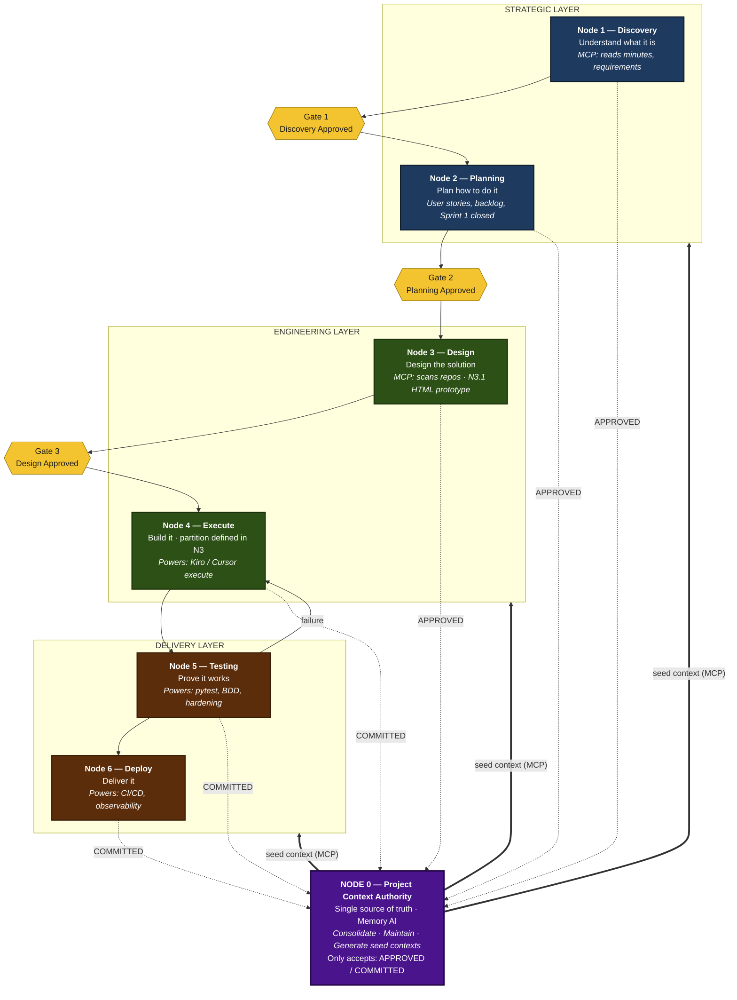
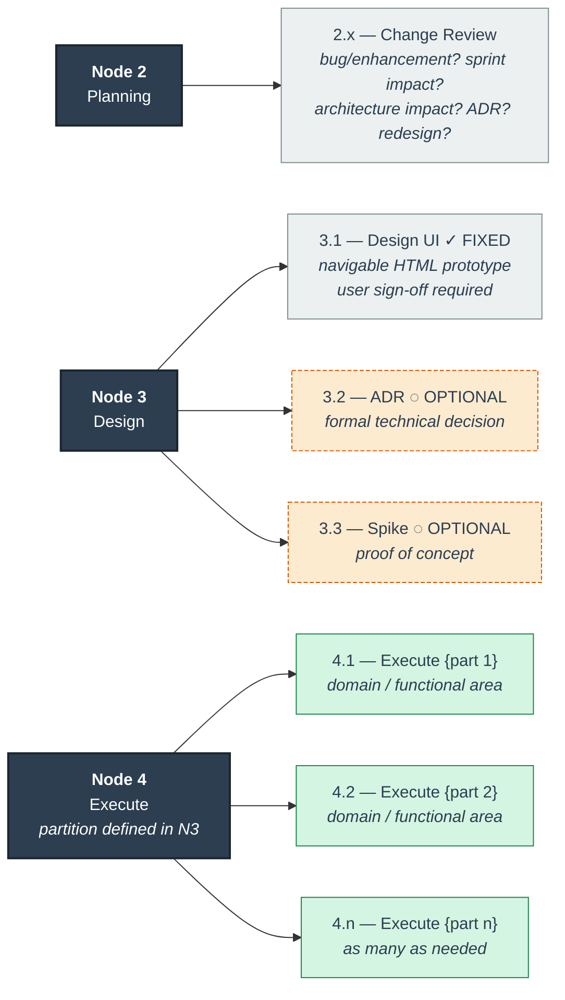
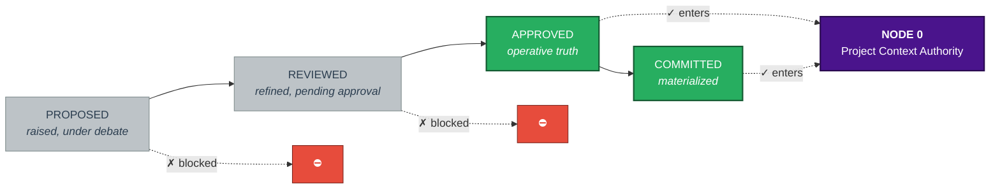
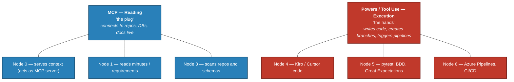
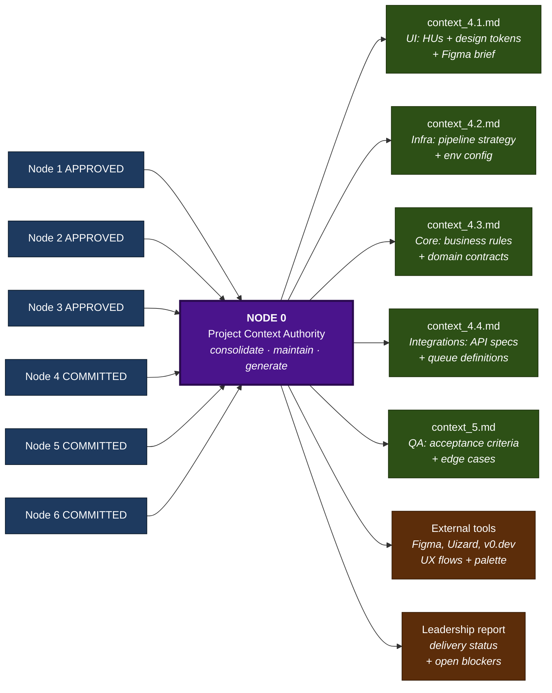
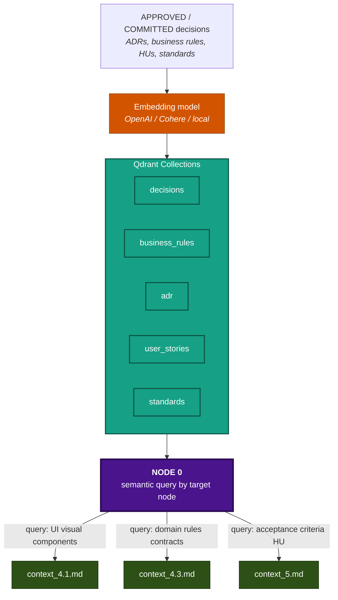
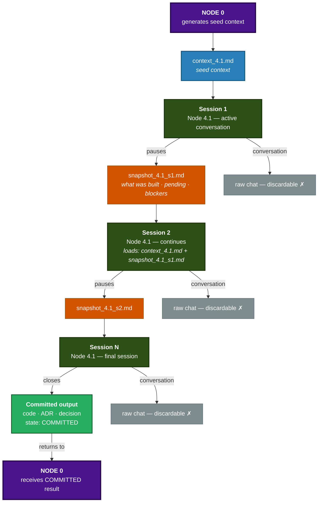
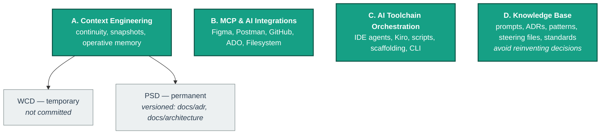
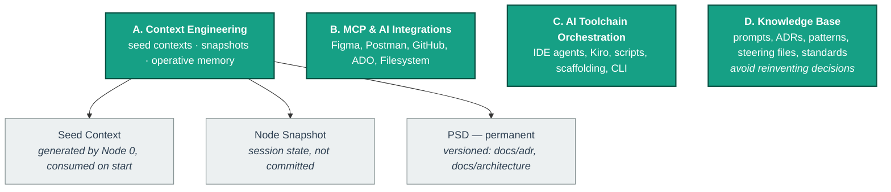

# AODF — Diagrams

Mermaid diagrams for the **AI-Orchestrated Delivery Framework**. Render natively in GitHub/GitLab inside ` ```mermaid ` blocks.

---

## Diagram 1 — Overview: layers, nodes and flow

Waterfall flow with three mandatory gates, testing correction loop, Node 0 seed context generation, and universal return to Node 0.



---

## Diagram 2 — Subnodes per node

Detailed view of specialized subnodes. N4.x partition is defined in Node 3 per project — examples shown are illustrative.



---

## Diagram 3 — State governance

Decision lifecycle and which states are allowed into Node 0.



---

## Diagram 4 — Agentic capabilities: MCP vs Powers

Which protocol each node activates. MCP = reading ("the plug"); Powers = execution ("the hands").



---

## Diagram 5 — Node 0: seed context generation

Node 0 active role — consolidates state and generates tailored seed contexts per target.



---

## Diagram 6 — Qdrant semantic memory layer

How Qdrant powers Node 0's semantic context generation.



---

## Diagram 8 — Node Lifecycle

A node is a complete conversation. This diagram shows how sessions chain together using seed contexts and snapshots, and what exits to Node 0.



Four capabilities that run across all nodes.



---

## Diagram 9 — Cross-cutting capabilities

Four capabilities that run across all nodes.


